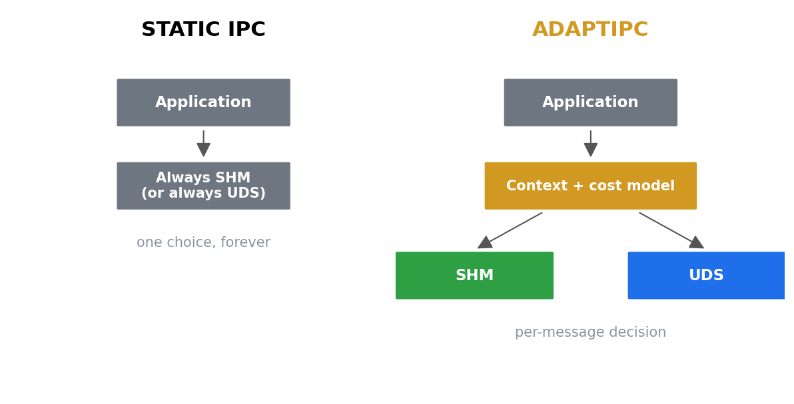
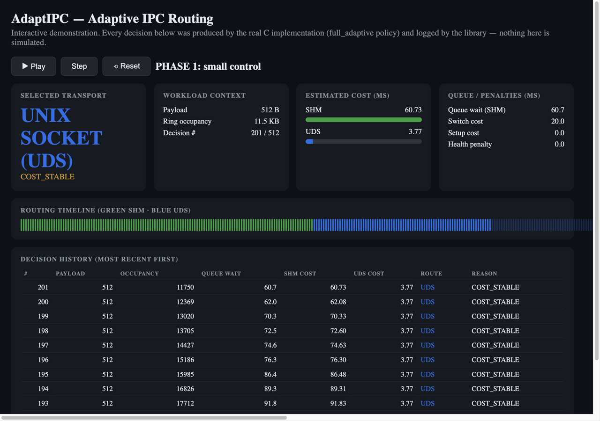
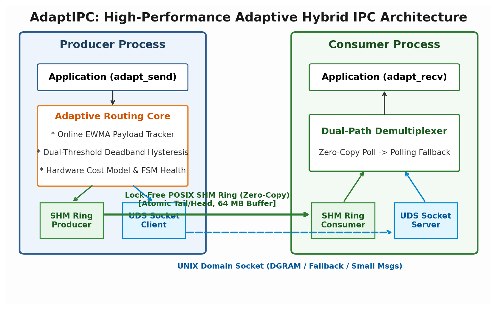
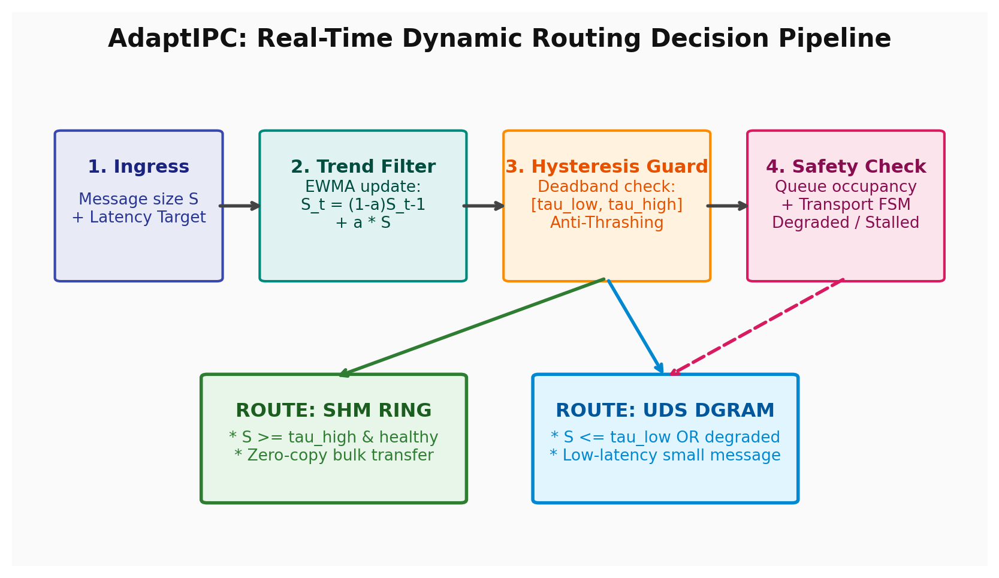

<div align="center">

# AdaptIPC

**Adaptive Inter-Process Communication Routing Middleware**

*One API. The right transport for every message.*

[🌐 Interactive Website](https://miskinabhijeet2025-ai.github.io/adaptipc/) ·
[🚀 Live Demo](https://miskinabhijeet2025-ai.github.io/adaptipc/demo.html) ·
[📊 Experiments](experiments/README.md) ·
[📄 Paper](paper/Dynamic_IPC_Routing.pdf) ·
[💻 Source](https://github.com/miskinabhijeet2025-ai/adaptipc)




</div>

---

AdaptIPC dynamically routes each message between a **lock-free shared-memory
ring** and **Unix domain sockets**, using workload context, measured transport
costs, queue state, transport health, and hysteresis-aware decision logic —
instead of committing a channel to one transport at deployment time.

## ✅ Verified Results

Every number below traces to a checked-in artifact and a reproduction command.

| Result | Value | Source artifact | Reproduce |
|---|---|---|---|
| **Peak adaptive throughput** | 9,444 MB/s (**31.4×** UDS) | `experiments/raw/payload_sweep.csv` | `./scripts/generate_showcase.sh` |
| **Mixed-workload gain (bimodal)** | 5,678 MB/s (**8.1×** UDS) | `benchmarks/summary.txt` + Table I | `python3 scripts/ratio_check.py` |
| **Anti-thrash stability** | **0** route switches / 100k adversarial msgs | `benchmarks/summary.txt` | `python3 scripts/ratio_check.py` |
| **Throughput retention under thrash** | 477 MB/s (**2.2×** UDS) | `benchmarks/summary.txt` | `python3 scripts/ratio_check.py` |
| **Correctness** | 10/10 suites, ASan/LSan/TSan clean | `tests/` | `./demo/adaptipc_lab.sh -experiment correctness` |
| **Backlog bound** | 14 frames (57 KB) vs unbounded ring | `experiments/v2_1/raw/` | `./demo/adaptipc_lab.sh -experiment all` |
| **Lazy setup win** | 0.40 ms vs 1.82 ms eager init | `benchmarks/init_latency.txt` | `./scripts/run_benchmarks.sh` |

> Hardware-dependent measurements were collected on Apple silicon
> (median-of-3); see [Reproducibility notes](#reproducibility-notes).

## 🚀 See It Work

Three entry points, fastest first:

```sh
./scripts/demo.sh                 # ~1 min: live progress, terminal summary card
./showcase/run_demo.sh            # ~15 s: build + 600-msg run + dashboard
./scripts/professor_demo.sh       # full verification: tests + drift check + figures
```

Each builds the **real implementation**, runs a demo workload through the
actual adaptive policy, captures per-decision telemetry, and renders the
interactive dashboard: payload, estimated SHM/UDS costs, queue wait, switching
margin, reason, and the routing timeline — every decision, replayable.

<p align="center">
  
</p>

```sh
# serve the interactive dashboard (zero dependencies)
python3 showcase/scripts/serve_dashboard.py --port 8000
# open http://localhost:8000/showcase/dashboard/index.html
```

> *Interactive demonstration workload — not the paper's authoritative
> benchmark (that is `./demo/adaptipc_lab.sh -runall`).*

## How AdaptIPC Makes a Decision

<p align="center">
  
</p>

```
Application
    ↓ adapt_send()
Context Collector (runtime_context.c)
    payload size, ring occupancy, EWMA arrival rate,
    EWMA consumer drain rate, consumer-activity signal
    ↓
Cost Estimator (cost_model.c)
    cost_T(S) = fixed_T + slope_T·S          (online-calibrated)
    queue_wait(SHM) = occupancy / drain_rate  (conservative fallback)
    notify floor (SHM) = 2 ms if consumer idle, else ~5 µs
    setup cost (SHM, if unmapped) = 52 µs
    ↓
Adaptive Policy
    Score(T) = transport_cost + queue_cost + setup_cost
             + switching_cost + health_penalty + latency_penalty
    switch only if  Score(new) + margin < Score(current)
    ↓
Transport Health (transport_health.c)
    HEALTHY ⇄ DEGRADED ⇄ BLOCKED → RECOVERING → HEALTHY (debounced)
```

Policy modes form an ablation ladder: `size_only` → `size_hysteresis`
(the validated baseline) → `queue_aware` → `cost_aware` → `full_adaptive`.
Select via `adapt_config_t.policy` or `ADAPTIPC_POLICY=<name>`.

## 📊 Experiment Index

Ten publication-grade figures, each regenerated from committed raw data:

| Figure | What it shows | Source data |
|---|---|---|
| [fig01 Throughput vs size](assets/figures/fig01_throughput_vs_size.png) | SHM/UDS/adaptive throughput across payload sizes | `benchmarks/results_sweep.csv` |
| [fig02 Latency vs size](assets/figures/fig02_latency_vs_size.png) | Per-size median latency by transport | `benchmarks/results_sweep.csv` |
| [fig03 Routing decisions](assets/figures/fig03_routing_decisions.png) | Real routing trace: payload → route over time | `showcase/outputs/routing_trace.csv` |
| [fig04 Policy comparison](assets/figures/fig04_policy_comparison.png) | Ablation ladder throughput comparison | `experiments/raw/payload_sweep.csv` |
| [fig05 Stability](assets/figures/fig05_stability.png) | Adversarial boundary traffic, zero flapping | `experiments/v2_1/raw/adversarial_delta.csv` |
| [fig06 Queue-aware](assets/figures/fig06_queue_aware.png) | Queue occupancy prediction accuracy | `experiments/v2_1/raw/queue_prediction_accuracy.csv` |
| [fig07 Transport health](assets/figures/fig07_transport_health.png) | Health-state machine under induced stalls | `experiments/v2_1/raw/stall_timeline.csv` |
| [fig08 Cost breakdown](assets/figures/fig08_cost_breakdown.png) | Per-decision cost model decomposition | `showcase/outputs/decision_log.jsonl` |
| [fig09 α sensitivity](assets/figures/fig09_alpha_sensitivity.png) | EWMA smoothing-factor sweep | `benchmarks/alpha_sensitivity.txt` |
| [fig10 Decision timeline](assets/figures/fig10_decision_timeline.png) | 600 real decisions, switches highlighted | `showcase/outputs/decision_log.jsonl` |

<p align="center">
  
</p>

Regenerate everything: `./scripts/generate_showcase.sh` (figures + diagrams +
REPORT.md with provenance metadata).


## Repository Navigation

| Section | Description |
|---|---|
| `src/`, `include/` | AdaptIPC implementation and public API |
| `tests/` | correctness tests (10 suites, sanitizers clean) |
| `benchmarks/` | benchmark sources + authoritative `summary.txt` (median-of-3) |
| `experiments/` | experiment campaigns: raw CSVs, summaries, per-run archives |
| `scripts/` | reproduction, verification, and showcase pipeline scripts |
| `showcase/` | interactive demo suite: harnesses, dashboard, figures |
| `paper/` | research paper (LaTeX + PDF) |
| `demo/` | professor experiment lab CLI |
| `docs/` | `EXPERIMENT_GUIDE.md`, `PROFESSOR_DEMO.md` presentation script |
| `website/` | interactive website (GitHub Pages) |

## Building

Requirements: any C11 compiler (clang or gcc), CMake ≥ 3.16, POSIX SHM/UDS
support. Developed and measured on macOS (Apple silicon); Linux should work
unchanged.

```sh
cmake -B build && cmake --build build
ctest --test-dir build          # unit tests + benchmark smoke test
```

## Reproducing the Measurement Campaign

The full campaign (9 workload × transport combinations, ~105 GB transferred
per bimodal mode) takes roughly five minutes on an idle machine:

```sh
./scripts/run_benchmarks.sh                      # -O3 build + all measurements
BIMODAL_ITERS=200 ./scripts/run_benchmarks.sh    # quick smoke variant

python3 scripts/plot_results.py     # fig1–fig3 from the CSVs
python3 scripts/combine_runs.py    # median-combine N campaigns
python3 scripts/ratio_check.py     # consistency gate: Table I vs. summary.txt
```

Raw metrics land in `benchmarks/results_*.csv` and a human-readable log in
`benchmarks/summary.txt` (median of three campaign runs; per-run logs are
preserved as `summary_run{1,2,3}.txt`). `ratio_check.py` re-derives every
throughput number in Table I of the paper and exits non-zero on drift > 5%.

Standalone microbenchmarks (cost-model constants, UDS round-trip latency,
EWMA α sensitivity, `adapt_init()` creation cost) build individually — see
the header comment of each `.c` file under `benchmarks/`.

## One-command Experiment Lab

```sh
./demo/adaptipc_lab.sh -presentation   # fast in-class demo (~1 min)
./demo/adaptipc_lab.sh                 # interactive menu
./demo/adaptipc_lab.sh -experiment all # full research campaign
./demo/adaptipc_lab.sh -live           # live router dashboard
```

Every experiment writes raw CSVs into a unique timestamped directory
`experiments/runs/<date_time>_<label>/` — historical runs are never
overwritten. `scripts/lab_analyze.py` derives processed CSVs, figures, tables,
and a static `report/report.html` **from the raw data**; provenance (run id +
git commit) is embedded in `run_metadata.json`.

## Reproducibility Notes

* Every quantitative claim in the paper traces to the checked-in
  `benchmarks/summary.txt` (median of three campaign runs) and preserved
  per-run logs; `scripts/ratio_check.py` re-derives Table I and exits
  non-zero on drift.
* Measurements were collected on a single Apple-silicon Mac without CPU
  pinning; up to ~3× run-to-run variance was observed on the socket
  baseline under background load (see paper Section V-B, Limitations).
* Raw experiment CSVs carry platform/compiler/seed metadata; every

## Policy Modes (Ablation Ladder)

| mode | behavior |
|---|---|
| `size_only` | raw EWMA threshold, no deadband |
| `size_hysteresis` | original validated policy (default) |
| `queue_aware` | + queue-wait escape from a backlogged ring |
| `cost_aware` | + measured per-transport costs, switching margin, setup and notification modeling |
| `full_adaptive` | + transport health, learned crossover, QoS |

Select via `adapt_config_t.policy` or `ADAPTIPC_POLICY=<name>`.
QoS: `adapt_config_t.qos` ∈ {balanced, latency, throughput} plus
`latency_budget_us` (env: `ADAPTIPC_QOS`, `ADAPTIPC_LATENCY_BUDGET_US`).

## Stability Argument

The decision margin H implements the same anti-thrash guarantee as the
size-only deadband: if per-side cost-estimation error is bounded by ε,
noise alone cannot flip a route while H > 2ε. The learned crossover S*
is clamped to a bounded range and rate-limited by an EWMA; the health
model requires `debounce` consecutive samples before any transition.

## Decision Logging

Set `ADAPTIPC_DECISION_LOG=path` to dump a CSV of the last 512 routing
decisions (payload, occupancy, per-transport costs, queue wait,
switch/setup/health/latency penalties, final scores, selected route,
reason). Disabled by default; zero cost when disabled.

## Known Limitations

* macOS `shm_open(O_TRUNC)` returns EINVAL on existing objects; the ring
  deliberately avoids O_TRUNC and re-initializes cursors instead.
* io_uring support is compile-time optional on Linux and reported as
  UNSUPPORTED elsewhere.
* UDS `SOCK_DGRAM` drops datagrams silently when the receiver queue
  overflows; pure-UDS baselines cap payload sweeps at 64 KB.
* The cost model is linear in payload size; extreme bimodality within
  one size class degrades the fit until recalibration.

## Paper

```sh
cd paper && tectonic main.tex       # or: pdflatex main.tex (run twice)
```

`IEEEtran.cls` is checked in, so no TeX distribution package install is
needed beyond a basic engine. Figures resolve from `../benchmarks/`.

## License

No open-source license is currently attached to this repository; all
rights remain with the authors. If you wish to reuse the code or text,
please open an issue or contact the authors. (The paper text in `paper/`
may additionally be subject to copyright transfer to its publication
venue.)

  experiment uses the identical workload across policies. Shortfalls are
  recorded as `dropped=N` in the notes column — never silently dropped or
  fabricated.
